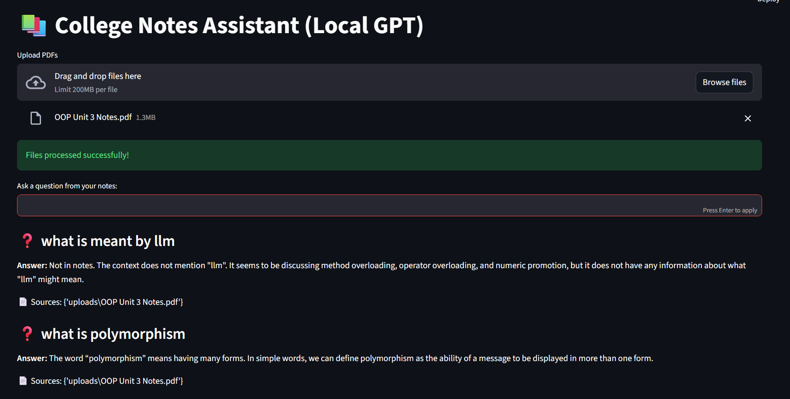

# College Notes Assistant (Local GPT)

An AI-powered system that allows users to upload PDF notes and ask questions using a local language model.  
It uses Retrieval-Augmented Generation (RAG) to provide accurate, context-based answers.

---

## Features

-  PDF-based Question Answering  
-  Fast semantic search using FAISS  
-  Local AI model (LLaMA 3 via Ollama)  
-  Works offline after setup  
-  Context-aware answers (no hallucination)  

---

## How It Works

1. Upload PDF  
2. Extract text from document  
3. Split text into chunks  
4. Convert chunks into embeddings  
5. Store embeddings in FAISS  
6. Convert user query into vector  
7. Retrieve relevant chunks  
8. Generate answer using LLM  

---

## 🧩 Architecture

PDF → Text → Chunks → Embeddings → FAISS  
User Query → Similarity Search → LLM → Answer  

---

## Tech Stack

- Python  
- Streamlit  
- LangChain  
- FAISS (Vector Database)  
- Ollama (Local LLM Runtime)  

---

## Project Type

This is a **Retrieval-Augmented Generation (RAG)** system using pre-trained machine learning models.

---

## Limitations

- Cannot detect repeated questions  
- Depends on PDF quality  
- Cannot understand structured queries (like slide numbers)  
- Uses pre-trained models (no custom training)  

---

## Future Improvements

- Add chat-based interface  
- Improve retrieval accuracy  
- Support multiple documents intelligently  
- Deploy as a web application  

---

## Why This Project

Students spend a lot of time manually searching through notes.  
This project automates that process using AI, improving efficiency and productivity.

---
## Demo

